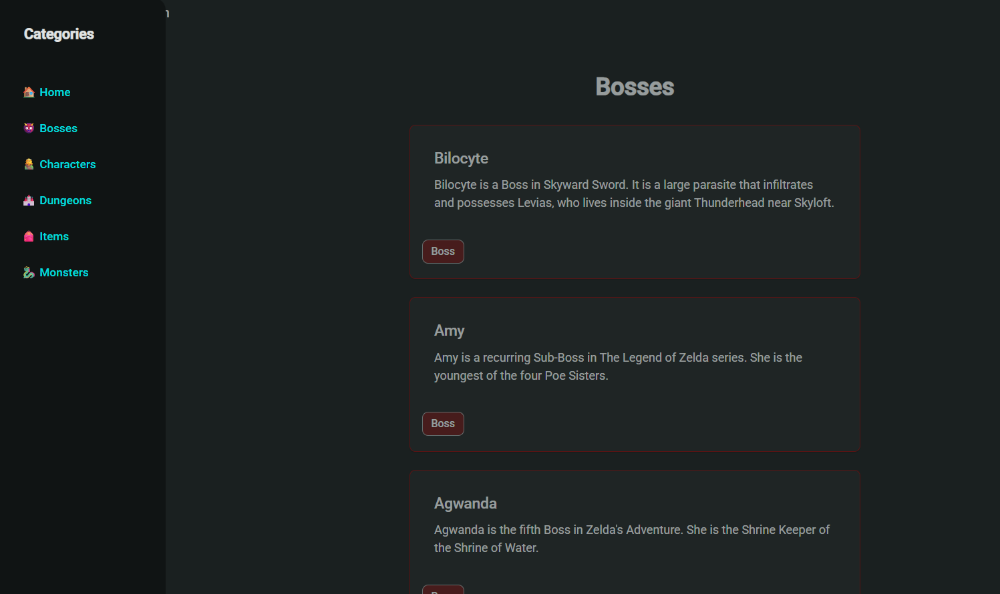

# Zelda Compendium

A simple Angular application that showcases various categories from the Zelda universe: Bosses, Characters, Dungeons, Items, and Monsters. 

## Features

- **Category Navigation:** Switch between categories using a Material Sidenav and Toolbar.
- **Data Binding:** Dynamic display of data using property and event binding.
- **Directives:** Uses `*ngIf` and `*ngFor` for conditional rendering and list iteration.
- **Lifecycle Hooks:** Uses `ngOnInit` in components to initialize the lists for each category.
- **Angular Material Layout:** Responsive layout with Toolbar, Sidenav, and Card components for a clean look.
- **Profile Form (Template-driven):** A profile creation form built using Angular's template-driven approach.

### Angular Architecture

Angular applications are built using a component-based and modular architecture:

- **Components** are the core building blocks of the UI. Each component encapsulates its own HTML, logic, and styles. It controls a section of the UI called a *view*.
- **Modules** group related components, directives, and pipes into cohesive blocks of functionality. The root module (`AppModule`) bootstraps the application, and feature modules can be added to organize code better.
- **Services** contain business logic and reusable functions such as HTTP calls, data processing, or state management. They are typically injected into components via Angular’s **Dependency Injection (DI)** system.

This architecture encourages **separation of concerns**, **code reuse**, and **scalability** for large projects.

### Interpolation and Binding

- **Interpolation (`{{ property }}`):** Inserts component property values into the HTML. Example: `{{ hero.name }}`
- **Property Binding (`[property]="value"`):** Sets element properties dynamically. Example: `[src]="imageUrl"`
- **Event Binding (`(event)="handler()"`):** Triggers methods when an event occurs. Example: `(click)="onClick()"`
- **Two-way Binding (`[(ngModel)]`):** Synchronizes the input field and the component property in both directions, useful in forms.

### Directives

Angular directives add behavior to elements:

- **Structural Directives** change the DOM layout:
  - `*ngIf`: Conditionally includes or excludes an element.
  - `*ngFor`: Iterates over collections to render elements dynamically.
- **Attribute Directives** modify appearance or behavior:
  - Examples: `ngClass`, `ngStyle`, and Angular Material directives like `mat-card`, `mat-form-field`.

### Pipes

Pipes transform displayed values in templates:

- Built-in pipes: `uppercase`, `lowercase`, `date`, `currency`, etc.
- Usage: `{{ name | uppercase }}` → transforms `name` to uppercase.
- You can create **custom pipes** to handle specific formatting logic.

## Lifecycle Hooks

Angular components go through a series of lifecycle stages. These are managed through lifecycle hooks:

- **`ngOnInit()`**: Called once after the component is initialized. Ideal for fetching data or setting up logic.
- **`ngOnDestroy()`**: Invoked right before a component is removed from the DOM. Used to clean up timers, subscriptions, or event listeners.
- **`ngOnChanges()`**: Triggered when input-bound properties change.
- **`ngAfterViewInit()`**: Called after Angular fully initializes the component’s view.

Using these hooks correctly helps manage component behavior, memory, and data flow across the app.

## Angular Material

**Angular Material** is a UI component library that follows Google’s Material Design principles. It offers pre-styled, accessible, and responsive components that speed up frontend development.

### Layout Basics:

- **Toolbar (`<mat-toolbar>`):** For top navigation and branding.
- **Sidenav (`<mat-sidenav-container>`):** For responsive side navigation menus.
- **Cards (`<mat-card>`):** For content grouping with elevation and padding.
- **Buttons, Icons, and Form Fields:** Provide consistency and modern interactions.
- **Grid and Flex Layout:** Used to create responsive, mobile-friendly UI structures.

By combining these layout tools, developers can rapidly build polished UIs without writing complex CSS from scratch.

## Screenshots

  
  
  

